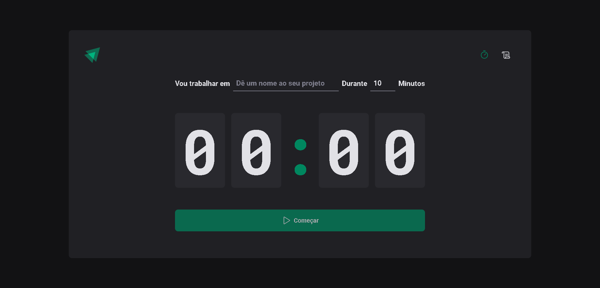
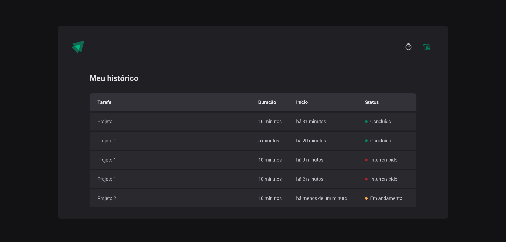

# Ignite Timer

<div align="center">
	
  
</div>

## :dart: Objetivo

Projeto que aplica o método de pomodoro, permitindo ao usuário cronometrar as
suas tarefas no dia a dia, além de lhe permitir ver um histórico de todos as
tarefas já realizadas. Projeto desenvolvido com o conteúdo estudado nas aulas do
Chapter II da trilha de ReactJS do Bootcamp Ignite da Rocketseat

## :hammer_and_wrench: Ferramentas

- [@phosphor-icons/react](https://github.com/phosphor-icons/react)
- [date-fns](https://www.npmjs.com/package/date-fns)
- [immer](https://github.com/immerjs/immer)
- [react](https://pt-br.reactjs.org/)
- [react-hook-form](https://react-hook-form.com/)
- [react-router-dom](https://reactrouter.com/en/main)
- [styled-components](https://styled-components.com/)
- [typescript](https://www.typescriptlang.org/)
- [zod](https://github.com/colinhacks/zod)

## :desktop_computer: Padronização de código

- [Eslint](https://eslint.org/)
- [Prettier](https://prettier.io/)
- [EditorConfig](https://editorconfig.org/)

## :rocket: Executando o projeto

```bash
// Instale as dependências

yarn install

// Concluindo a instalação rode

yarn dev
```
